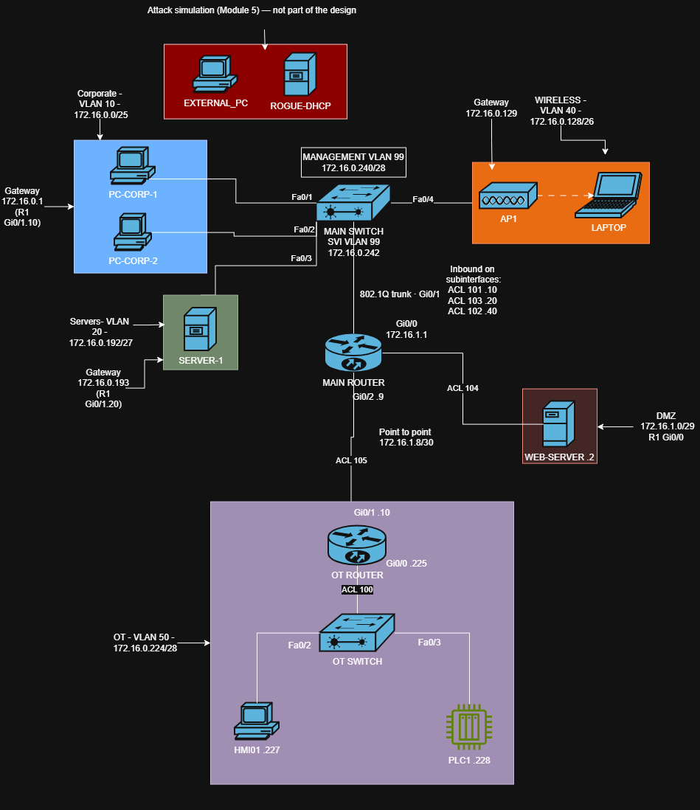

# Network Security Lab — Segmented IT/OT Network

Design, implementation and security assessment of a segmented network for a
small industrial plant, built in Cisco Packet Tracer and validated against a
live network with Wireshark.

The core of the project is the separation between the corporate network (IT)
and the plant floor (OT): the OT zone sits behind its own router, reachable
only through explicitly permitted traffic.

## What this project covers

- VLSM addressing plan for six zones from a single /22 block
- VLANs, 802.1Q trunking and router-on-a-stick inter-VLAN routing
- Network services: DHCP with relay, DNS, NTP, Syslog, AAA with RADIUS, wireless
- IT/OT segmentation with ACLs, and a DMZ isolated from the internal network
- Layer 2 hardening: port security, DHCP snooping, Dynamic ARP Inspection
- Live traffic analysis of DHCP, ARP and DNS
- Threat simulation (rogue DHCP) and a threat model
- Three real failures documented with the CompTIA troubleshooting methodology

## Network zones

| Zone | VLAN | Subnet | Purpose |
|---|---|---|---|
| Corporate | 10 | 172.16.0.0/25 | Office workstations |
| Servers | 20 | 172.16.0.192/27 | DHCP, DNS, NTP, Syslog, RADIUS |
| DMZ | — | 172.16.1.0/29 | Public-facing web server, physically isolated on R1 Gi0/0 |
| Wireless | 40 | 172.16.0.128/26 | Corporate Wi-Fi clients |
| OT | 50 | 172.16.0.224/28 | HMI and PLC, behind a dedicated router |
| Management | 99 | 172.16.0.240/28 | Network device administration |

## Security design

**IT/OT conduit.** OT can only send Syslog and NTP to the server. The only
traffic allowed from IT into OT is UDP from the server, needed for NTP replies
(see finding 3). Controls are applied on both routers: R1 blocks IT subnets at
the source, and R2 enforces the conduit at the plant edge, so OT stays
protected even if R1 is misconfigured.

**Whitelist in OT, blacklist in IT.** The OT zone permits only what is
explicitly required and denies everything else. IT zones block specific
destinations and allow normal traffic, because availability of ordinary
services matters there.

**DMZ.** The web server is assumed to be compromised at some point. It can
reach DNS, NTP and Syslog on the server and nothing else inside the network.

**Layer 2.** Port security on the main switch access ports: `shutdown` on
Corporate ports and `restrict` on the Servers port, where availability
outweighs the cost of an interruption. DHCP snooping and DAI protect the
Corporate and Wireless VLANs and trust only the uplink.

## Documentation

| Document | Content |
|---|---|
| [01 — Addressing plan](docs/01-addressing-plan.md) | VLSM design and address assignments |
| [02 — Services](docs/02-services-config.md) | VLANs, routing, DHCP, DNS, NTP, Syslog, AAA, wireless |
| [03 — Security controls](docs/03-security-controls.md) | ACLs, port security, DHCP snooping, DAI |
| [04 — Traffic analysis](docs/04-traffic-analysis.md) | Live captures of DHCP, ARP and DNS |
| [05 — Threats and detection](docs/05-threats-and-detection.md) | Rogue DHCP simulation and threat model |
| [06 — Troubleshooting log](docs/06-troubleshooting-log.md) | Three real failures, diagnosed step by step |
| [Scope](SCOPE.md) | Rules of engagement and data handling |

## Findings

| # | Finding | Severity | Recommendation |
|---|---|---|---|
| 1 | RADIUS shared secret stored in plaintext in the running configuration | High | Use encrypted password types and restrict access to configuration files |
| 2 | IT/OT conduit relies on stateless ACLs | High | Replace with a stateful industrial firewall, as recommended by IEC 62443 |
| 3 | ACL 105 return rule permits any UDP from the server toward OT | Medium | Restrict to the source ports actually in use |
| 4 | No RA Guard; hosts have IPv6 enabled on the LAN | Medium | Configure RA Guard on access ports |
| 5 | LLMNR enabled by default on clients | Medium | Disable LLMNR and NetBIOS name service via Group Policy |
| 6 | Wireless uses a shared passphrase (WPA2-PSK) | Medium | Migrate to WPA2-Enterprise with 802.1X |
| 7 | Internal NTP source is not validated against an external reference | Medium | Synchronize the NTP server with a trusted external source |
| 8 | DHCP snooping not applied to the Servers VLAN | Low | Extend snooping to all VLANs with DHCP clients |
| 9 | OT and DMZ subnets have no address headroom | Low | Accepted by design; growth triggers a design review |

## Limitations

- Packet Tracer does not support stateful firewalls, WPA2-Enterprise, or
  industrial protocols such as Modbus and DNP3.
- The lab has no Internet uplink; Internet-facing rules are documented as
  design only.
- SLAAC could not be captured because my ISP does not provide IPv6.
- VPN traffic was not captured in this version.

## Planned additions

- `arp_watch.py`: a Python script that alerts when an IP address changes MAC
- Scan signature analysis with nmap, run only against my own VM
- Phishing header analysis (SPF, DKIM, DMARC)

## Tools

Cisco Packet Tracer 8.x · Wireshark · Windows command line tools (`ipconfig`,
`arp`, `nslookup`, `netstat`, `tracert`) · draw.io

## Lessons learned

- Stateless ACLs block replies as easily as requests. I broke NTP in the OT
  zone by closing one direction without thinking about the return traffic.
- An ACL on an interface also filters traffic sent to the router itself.
  Removing a single permit line made R2 unreachable.
- Configuration that is not saved does not survive a restart. I lost my RADIUS
  setup that way, and found out my backup account had never been tested.
- Real captures show what a simulator hides: DHCP is not all broadcast, and ARP
  checks for duplicate addresses before a host uses an IP.
