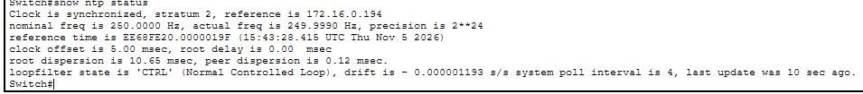
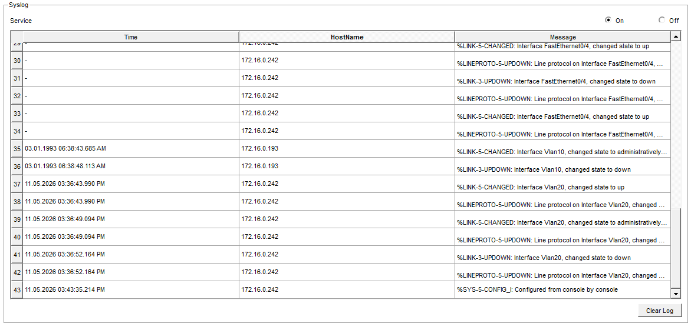
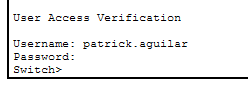
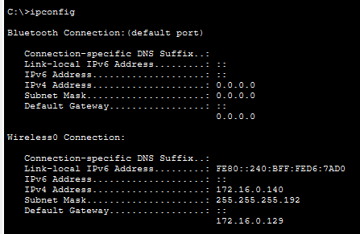

## VLANs and Routing

I created VLAN 10 for corporate and VLAN 20 for servers.

- Switchport VLAN 10 for FE0/1 and FE0/2
- Switchport VLAN 20 for FE0/3

To allow communication between different VLANs, I established a router on a stick with a trunk port, so corporate can reach services in the servers VLAN such as DHCP and, later, DNS.

**Switch — trunk configuration**

```
interface gigabitethernet0/1
 switchport mode trunk
```

**Router — subinterface configuration**

```
enable
configure terminal
interface gigabitethernet0/1
 no shutdown
 exit
interface gigabitethernet0/1.10
 encapsulation dot1q 10
 ip address 172.16.0.1 255.255.255.128
 exit
```

`no shutdown` turns on the physical port. `encapsulation dot1q 10` tells the subinterface to process frames tagged with VLAN 10. The IP address is the default gateway of the corporate VLAN.

## DHCP

I need user pools for the corporate and wireless VLANs.

**Corporate pool**

- Default gateway: 172.16.0.1
- Start IP address: 172.16.0.10 — .2 to .9 left for infrastructure
- Subnet mask: 255.255.255.128
- Maximum number of users: 100

I checked that 100 addresses do not overlap the broadcast address.

**Wireless pool**

- Default gateway: 172.16.0.129
- Start IP address: 172.16.0.139 — .130 to .138 left for infrastructure
- Maximum number of users: 50

Since the DHCP broadcast stops at the router, I configured `ip helper-address` as a DHCP relay so the router forwards the broadcast as a unicast to the DHCP server.

## Issues

**PC-CORP-2 could not reach the server**

PC-CORP-1 already reached the server with ping and PC-CORP-2 did not, so the problem had to be in PC-CORP-2 itself. I opened its configuration, checked the default gateway, and it was not configured.

## DNS

I needed DNS to translate names into IPv4 addresses. I turned on the DNS service on the server and created an **A record**: `srv01.plant.local` pointing to `172.16.0.194`.

I also set the DNS server address in both DHCP pools, so clients receive it automatically.

DNS queries cross VLANs without a relay because they are unicast — the client already knows the server address, since DHCP provided it. DHCP itself needs a relay because the client has no address yet and must use broadcast.

## NTP and Syslog

I need to collect router and switch logs on the server through Syslog. However, I first have to activate NTP, so the log entries carry a correct timestamp.

A layer 2 switch forwards frames without needing an IP address. But when it has to originate traffic itself — querying NTP or sending logs to Syslog — it needs its own identity. That identity lives on an **SVI** (Switched Virtual Interface), a logical interface bound to a VLAN.

**Switch — management VLAN and SVI**

```
vlan 99
 name MANAGEMENT
 exit
interface vlan 99
 ip address 172.16.0.242 255.255.255.240
 no shutdown
 exit
ip default-gateway 172.16.0.241
```

**Router — management subinterface**

```
interface gigabitethernet0/1.99
 encapsulation dot1q 99
 ip address 172.16.0.241 255.255.255.240
 exit
```

**Verification**

`show ip interface brief` — Vlan99 has an IP and is up.

Ping from switch to server: 100% success.

**NTP**

With the SVI on the switch and the subinterface on the router, I configured `ntp server 172.16.0.194` on both devices and verified with `show ntp status`. The clock moved from stratum 16 (unsynchronized) to stratum 2, referencing the lab server.


**Syslog**

I enabled the Syslog service on the server and configured `logging 172.16.0.194` on the switch and the router. Syslog uses **UDP port 514**.



Without NTP, log entries from different devices cannot be correlated: you can see what happened, but not in which order across sources. That correlation is the basis of incident analysis.


## AAA with RADIUS for administrative access

Managing local users on every device does not scale. AAA centralizes it: the switch asks a server whether the user is allowed in, instead of storing accounts itself.


**Server side**

I enabled the AAA service, registered the switch as a RADIUS client with its IP and a shared secret, and created an administrative user.

**Switch side**

```
enable
configure terminal

username emergency-access privilege 15 secret <REDACTED>

aaa new-model

radius server RADIUS-SRV
 address ipv4 172.16.0.194 auth-port 1645
 key <REDACTED>
 exit

aaa authentication login default group radius local
```

| Command | Purpose |
|---|---|
| `username emergency-access` | Local break-glass account, created **before** enabling AAA |
| `aaa new-model` | Enables the AAA subsystem |
| `radius server RADIUS-SRV` | Defines the server entry |
| `address ipv4` | Server address and authentication port |
| `key` | Shared secret — must match the server exactly |
| `aaa authentication login default group radius local` | Try RADIUS first; fall back to the local database if it does not answer |

The `local` keyword at the end is critical. Without it, an unreachable RADIUS server locks us out of the device permanently.




**Finding — shared secrets stored in plaintext**

The shared secret is stored as a type 0 (plaintext) password in the running configuration and is visible to anyone who can read it. Recommendation: use an encrypted password type and restrict access to configuration files.

## Wireless

I created VLAN 40 for wireless clients.

**Switch**

```
vlan 40
 name WIRELESS
 exit
interface fastethernet0/4
 switchport mode access
 switchport access vlan 40
 exit
```

**Router**

```
interface gigabitethernet0/1.40
 encapsulation dot1q 40
 ip address 172.16.0.129 255.255.255.192
 ip helper-address 172.16.0.194
 exit
```

The helper address is required so wireless clients can reach the DHCP server across VLANs.

I configured the access point with SSID `CORP-WIFI`, WPA2-PSK authentication and AES encryption.


**Design note — WPA2-PSK instead of WPA2-Enterprise**

The lab uses WPA2-PSK because the Packet Tracer access point does not support 802.1X authentication against a RADIUS server. WPA2-Enterprise would be the correct choice for a corporate network: with PSK every client shares the same passphrase, so removing access for one user requires changing the key on all devices. Enterprise ties access to individual credentials, which can be revoked one at a time.
