# Security Controls — IT/OT Segmentation

## Introduction

This document describes the configuration and validation of:

- ACLs on MAIN-ROUTER and OT-ROUTER with strict control over connections between OT, CORPORATE, DMZ, WIRELESS and SERVERS.
- Port-security on MAIN-SWITCH and OT-SWITCH to prevent unauthorized devices.
- DHCP snooping to prevent rogue DHCP servers.
- DAI to prevent ARP poisoning.

## Access Control Lists

### ACL 100

```
access-list 100 permit udp 172.16.0.224 0.0.0.15 host 172.16.0.194 eq 514
access-list 100 permit udp 172.16.0.224 0.0.0.15 host 172.16.0.194 eq 123
```

This ACL permits OT to send Syslog and NTP to the server. Nothing else leaves the OT zone.

### ACL 101

```
access-list 101 deny ip 172.16.0.0 0.0.0.127 172.16.0.224 0.0.0.15
access-list 101 permit ip any any
```

This ACL denies all traffic from Corporate to OT, preventing a compromised PC from reaching the plant, and then lets the remaining traffic flow: DHCP, DNS and navigation.

### ACL 102

```
access-list 102 deny ip 172.16.0.128 0.0.0.63 172.16.0.224 0.0.0.15
access-list 102 permit ip any any
```

This ACL denies all traffic from wireless clients to OT, preventing a compromised wireless client from reaching the plant, and then lets the remaining traffic flow: DHCP, DNS and navigation.

### ACL 103

```
access-list 103 permit udp host 172.16.0.194 eq 123 172.16.0.224 0.0.0.15
access-list 103 permit udp host 172.16.0.194 eq 514 172.16.0.224 0.0.0.15
access-list 103 deny ip 172.16.0.192 0.0.0.31 172.16.0.224 0.0.0.15
access-list 103 permit ip any any
```

This ACL permits Syslog and NTP responses from the server to OT, and denies all other traffic from Servers to OT, preventing the server from starting a connection toward the plant.

### ACL 104

```
access-list 104 permit udp 172.16.1.0 0.0.0.7 host 172.16.0.194 eq 53
access-list 104 permit udp 172.16.1.0 0.0.0.7 host 172.16.0.194 eq 123
access-list 104 permit udp 172.16.1.0 0.0.0.7 host 172.16.0.194 eq 514
access-list 104 deny ip 172.16.1.0 0.0.0.7 172.16.0.0 0.0.3.255
access-list 104 permit ip any any
```

This ACL permits the DMZ to start connections to the server for DNS, NTP and Syslog, denies connections to the internal network, and lets the remaining traffic flow.

### ACL 105

```
access-list 105 permit udp host 172.16.0.194 172.16.0.224 0.0.0.15
access-list 105 deny ip any 172.16.0.224 0.0.0.15
access-list 105 permit ip any any
```

This ACL permits UDP traffic from the server to OT and denies all other traffic toward the OT zone.

## Applying the ACLs

**MAIN-ROUTER**

```
interface gigabitethernet0/1.10
 ip access-group 101 in
 exit
interface gigabitethernet0/1.40
 ip access-group 102 in
 exit
interface gigabitethernet0/1.20
 ip access-group 103 in
 exit
interface gigabitethernet0/0
 ip access-group 104 in
 exit
```

**OT-ROUTER**

```
interface gigabitethernet0/0
 ip access-group 100 in
 exit
interface gigabitethernet0/1
 ip access-group 105 in
 exit
```

## Testing the ACLs

### 1. OT does not start connections to the server except Syslog and NTP

**A.1 — Ping to server 172.16.0.194 before applying the ACL**

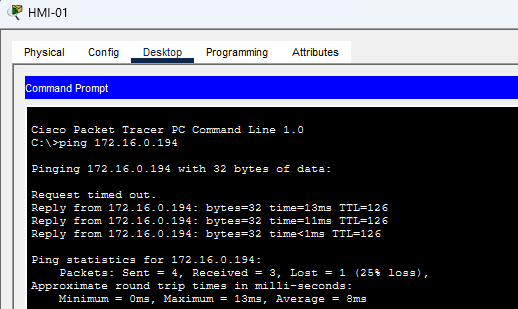

**A.2 — Ping to server 172.16.0.194 after applying the ACL**

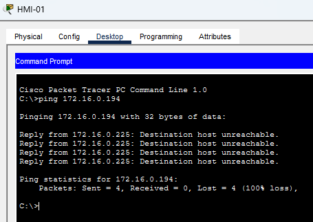

### 2. Corporate does not start connections to OT

**B.1 — Ping from PC-CORP-2 to HMI 172.16.0.227 before applying the ACL**

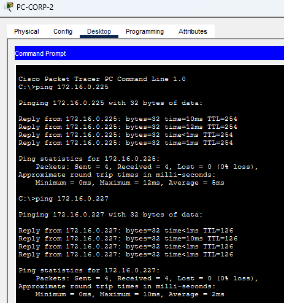

**B.2 — Ping from PC-CORP-2 to HMI 172.16.0.227 after applying the ACL**

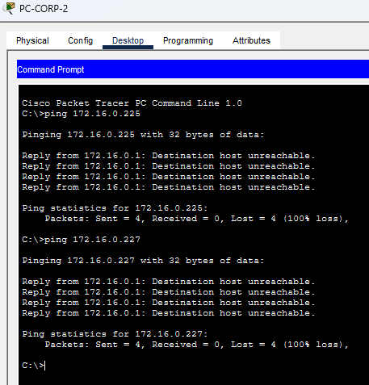

### 3. DMZ isolated from the internal network

**C.1 — Before applying the ACL**

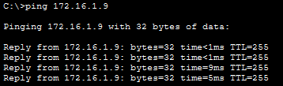

**C.2 — After applying ACL 104**

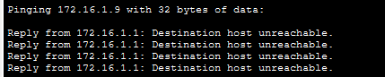

### 4. NTP still synchronized with ACL 103 in place

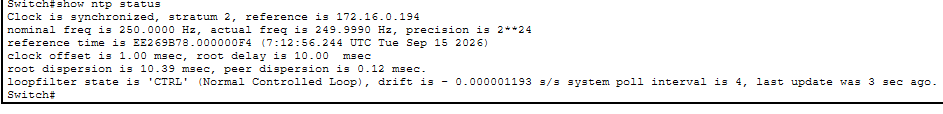

## Layer 2 Hardening

### MAIN-SWITCH

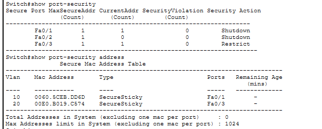

The network needs port-security on the Corporate and Servers interfaces because their MAC addresses stay the same. The wireless interface does not require port-security because the MAC addresses of the clients are always changing.

The violation response for Corporate was set to `shutdown` and for the server to `restrict`. The difference is that for Corporate a technician can review the problem if the port goes down, but the server is critical: it runs NTP, Syslog, DNS, DHCP and logging for OT and every IT device. Setting `shutdown` on the server interface could be catastrophic, because the whole network goes down if the server goes down.

Port-security with the `shutdown` violation parameter was enabled on interfaces FastEthernet0/1 and 0/2:

```
interface range fastethernet0/1 - 2
 switchport mode access
 switchport port-security
 switchport port-security maximum 1
 switchport port-security mac-address sticky
 switchport port-security violation shutdown
 exit
```

Port-security with the `restrict` violation parameter was enabled on the server interface:

```
interface fastethernet0/3
 switchport mode access
 switchport port-security
 switchport port-security maximum 1
 switchport port-security mac-address sticky
 switchport port-security violation restrict
 exit
```

### OT-SWITCH

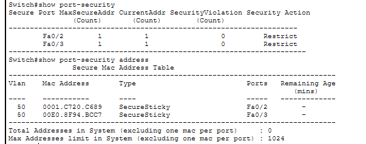

According to the AIC model, availability is critical here because we are talking about physical infrastructure close to people and production. As a result, the `restrict` violation parameter was set on the OT-SWITCH:

```
interface range fastethernet0/1 - 2
 switchport mode access
 switchport access vlan 50
 switchport port-security
 switchport port-security maximum 1
 switchport port-security mac-address sticky
 switchport port-security violation restrict
 exit
```

### DHCP snooping

This feature protects against rogue DHCP servers by defining which ports are allowed to send DHCP offers.

Because DHCP relay runs on the router over the trunk link, all DHCP offers arrive through GigabitEthernet0/1, so that interface was defined as the only trusted port. By default, all remaining interfaces are untrusted.

```
ip dhcp snooping
ip dhcp snooping vlan 10
ip dhcp snooping vlan 40
no ip dhcp snooping information option
interface gigabitethernet0/1
 ip dhcp snooping trust
 exit
```

Verified with:

```
show ip dhcp snooping
show ip dhcp snooping binding
```

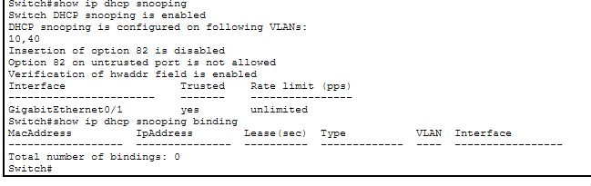

### Dynamic ARP Inspection

ARP poisoning is a real risk, and DAI was enabled to restrict it:

```
configure terminal
ip arp inspection vlan 10
ip arp inspection vlan 40
interface gigabitethernet0/1
 ip arp inspection trust
```

DAI validates ARP replies against the DHCP snooping table, so DHCP snooping must be active for it to work.

### Port-security validation

An unknown device was connected to FastEthernet0/2 on MAIN-SWITCH to validate port-security. The new device was blocked because its MAC address was not registered, and the port went into shutdown.

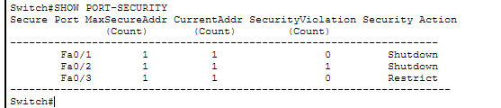

When a port is shut down after a port-security violation, `show interface fa0/2` reports the port as down with the `err-disabled` message.

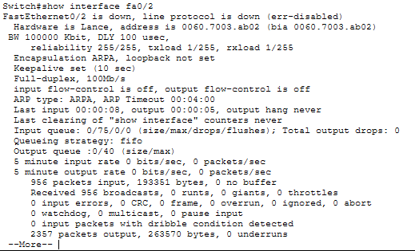

Topology view showing the port shut down against the external PC:

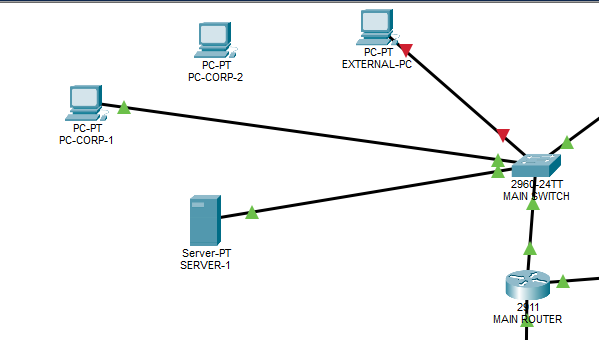

## Problems Found

### 1. NTP and Syslog from the OT switch blocked by ACL 103

The first version of ACL 103 was:

```
access-list 103 deny ip 172.16.0.192 0.0.0.31 172.16.0.224 0.0.0.15
access-list 103 permit ip any any
```

This blocked every NTP response at the main router. To let NTP and Syslog traffic flow from the server back to OT, ACL 103 was rewritten:

```
no access-list 103
access-list 103 permit udp host 172.16.0.194 eq 123 172.16.0.224 0.0.0.15
access-list 103 permit udp host 172.16.0.194 eq 514 172.16.0.224 0.0.0.15
access-list 103 deny ip 172.16.0.192 0.0.0.31 172.16.0.224 0.0.0.15
access-list 103 permit ip any any
```

`no access-list 103` deletes the whole list so it can be written again. In Packet Tracer a numbered ACL cannot take a new line at the top, so the entire list has to be rewritten.

### 2. R2 unreachable after removing `permit ip any any`

Removing `permit ip any any` from ACL 105 blocked all traffic destined to R2 itself, not just traffic toward the OT zone. An interface ACL cannot distinguish transit traffic from traffic addressed to the router. The rule was restored and the limitation documented.

## Findings

| # | Finding | Severity | Recommendation |
|---|---|---|---|
| 1 | The RADIUS shared secret is stored as a type 0 (plaintext) password in the running configuration | High | Use encrypted password types and restrict read access to configuration files |
| 2 | Stateless ACLs cannot separate return traffic from new sessions, so return rules must be written by hand | High | Replace the IT/OT conduit with a stateful industrial firewall, as recommended by IEC 62443 |
| 3 | The return rule in ACL 105 permits any UDP traffic from the server toward OT, which is broader than required | Medium | Narrow it to source ports 123 and 514, or use session tracking |
| 4 | DHCP snooping does not cover client-to-client traffic on the same access point | Medium | Enable client isolation on the access point |
| 5 | An internal NTP source guarantees consistent time, not correct time. The lab clock showed December while the real date was September | Medium | Synchronize the NTP server against an external trusted source such as pool.ntp.org or GPS |
| 6 | Wireless uses WPA2-PSK. A shared passphrase cannot be revoked for one user without changing it on every device | Medium | Migrate to WPA2-Enterprise with 802.1X against RADIUS |
| 7 | The OT and DMZ subnets have no address headroom: usable addresses equal the requirement | Low | Accepted by design. Any new device triggers a design review |
| 8 | The router originates traffic from its WAN interface IP, which complicates ACL design | Low | Set `ntp source` and `logging source-interface` to a fixed interface |

## Limitations

- **No Internet access.** The three ports on R1 are used by the trunk, the link to R2 and the DMZ. The Internet→DMZ and Corporate/Wireless→Internet rules remain as proposed design, not implemented.
- **No stateful firewall.** Packet Tracer does not support Zone-Based Firewall or reflexive ACLs. The IT/OT conduit is approximated with interface ACLs.
- **`established` not applicable.** It only works with TCP. Syslog and NTP are UDP, so return traffic is permitted by source host instead.
- **Level 0 not represented.** Sensors and actuators are not modeled as IP hosts. In a real plant they connect to the PLC through industrial buses such as 4-20 mA or Profibus, not Ethernet. The OT zone is modeled from Level 1 upward.
- **No industrial protocols.** Packet Tracer does not simulate Modbus or DNP3. OT devices are represented with generic equipment.
- **WPA2-Enterprise not available.** The Packet Tracer access point does not support 802.1X against a RADIUS server.
- **Unstable AAA behavior.** RADIUS authentication failed intermittently even with matching configuration on both ends. It resolved after restarting the simulator, which suggests a tool limitation rather than a configuration error.
