# Traffic Analysis — Live Network Validation

The lab implements these protocols in a simulator. This section captures them
on a live network to document their real packet structure.

All captures were taken on own network. MAC addresses are redacted
beyond the OUI, and no public addressing is shown.

## 1. DHCP and ARP

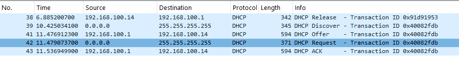

To capture DHCP and ARP on real traffic, the following commands were executed:

```
arp -d *
ipconfig /release
ipconfig /renew
ping 192.168.100.1
```

### 1.1 Discover — 0x40082fdb

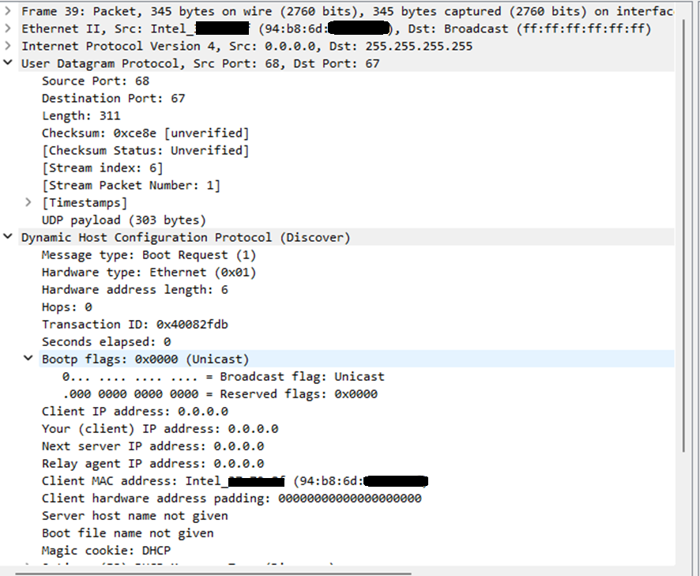

The Discover is sent from 0.0.0.0 to 255.255.255.255 as a broadcast, because
the client has no address yet and does not know where the server is.

### 1.2 Offer — 0x40082fdb

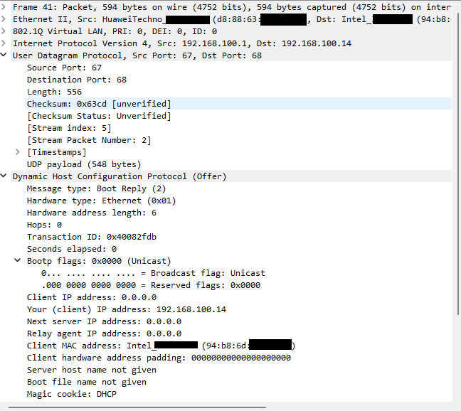

The Offer is sent by the router as a unicast. The broadcast flag is set to 0,
and the Discover already carried the client MAC address, so the server can
build the frame directly.

### 1.3 Request — 0x40082fdb

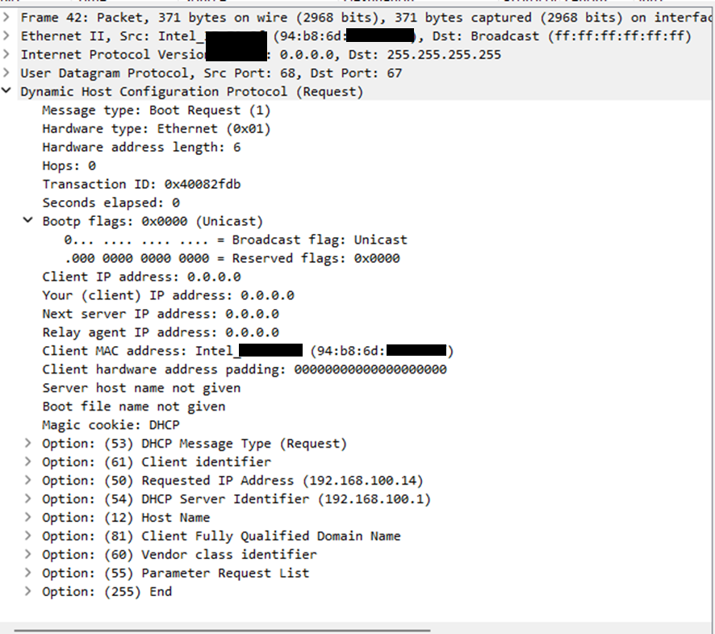

The Request is also sent as a broadcast, because other DHCP servers may have
made offers and need to know which one was selected so they can release the
address they had reserved.

DHCP defines 256 options numbered 0 to 255. Options 0 and 255 are PAD and END,
which leaves 254 usable. This Request carries:

| Option | Meaning |
|---|---|
| 53 | DHCP message type — Request |
| 61 | Client identifier — the client MAC |
| 50 | Requested IP address — which address the client wants |
| 54 | DHCP server identifier — which server was chosen |
| 12 | Host name — the device identification name |

Option 54 is also the field to inspect when investigating a rogue DHCP server:
two Offers carrying different server identifiers on the same segment indicate
an unauthorized server.

### 1.4 ACK — 0x40082fdb

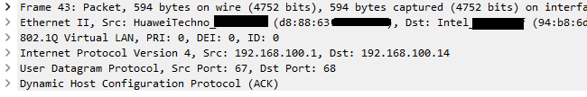

The ACK is unicast for the same reason as the Offer: the broadcast flag is 0
and the server knows the client MAC.

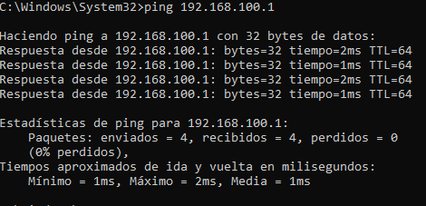

### Summary

| Message | Source | Destination | Delivery |
|---|---|---|---|
| Discover | 0.0.0.0 | 255.255.255.255 | Broadcast |
| Offer | 192.168.100.1 | 192.168.100.14 | Unicast |
| Request | 0.0.0.0 | 255.255.255.255 | Broadcast |
| ACK | 192.168.100.1 | 192.168.100.14 | Unicast |

Packet Tracer renders DORA as four symmetric broadcasts. On a live network the
exchange is asymmetric.

## 2. ARP


The live capture shows the full address acquisition lifecycle.

**Setup:** the ARP table was cleared with `arp -d *`, then the address was
released with `ipconfig /release` and requested again with `ipconfig /renew`.

**Line 8-9:** before the release, the client asks for the gateway MAC as a
broadcast and the gateway answers in unicast. This is standard ARP resolution.

**Line 38:** DHCP Release. It is sent unicast because the client had just
learned the gateway MAC in line 9.

**Line 40:** before sending the Offer, the DHCP server asks if anyone is using
the address it is about to assign. Since no one answered, the address is free
and the server offers it (RFC 2131).

**Line 44-115:** after the ACK, the client resolves the gateway three times in
300 ms. Several processes start at once when the interface comes back up, and
each one needs the gateway MAC before the cache entry is committed.

**Line 116, 135, 425:** the client probes its new address for duplicates, one
second apart (RFC 5227 DAD). The sender IP is 0.0.0.0 because the client does
not claim the address yet.

**Line 133-134:** the router asks for the address again and this time the
client answers. Compared with line 40, where no one replied, this confirms the
address changed from free to assigned.

**Line 573, 620:** two gratuitous ARP announcements two seconds apart, as
RFC 5227 specifies. Sender and target IP are the same because this is a
statement of ownership, not a question.

### 2.1 Broadcast request and unicast reply

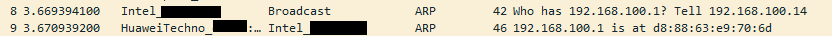

This capture shows how broadcast and unicast appear in practice.

**Frame 8 — broadcast request**

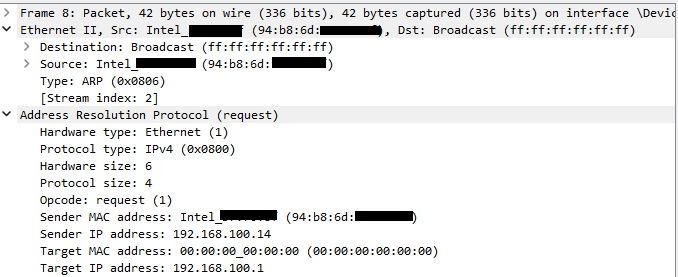

The Ethernet destination is `ff:ff:ff:ff:ff:ff`, and the target MAC address
field inside the ARP header is all zeros. That field is exactly what the client
is asking for, so it cannot be filled in, which is why the frame has to reach
every host on the segment.

**Frame 9 — unicast reply**

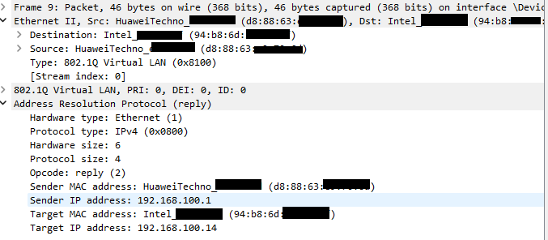

The reply is addressed to the requesting MAC and carries the real hardware
address. The opcode distinguishes the two messages: request (1) and reply (2).

## 3. DNS

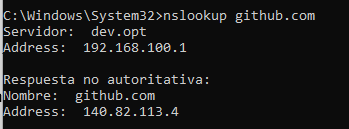

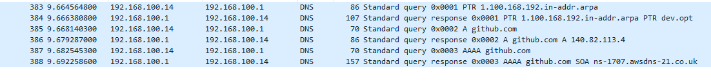

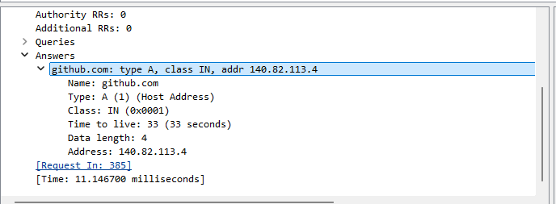

A single `nslookup github.com` command generates three separate queries.

**Line 383-384:** reverse lookup (PTR). nslookup only knows the DNS server by
its IP address, so it asks for the name behind 192.168.100.1. The answer,
dev.opt, is what the tool prints as "Server:".

**Line 385-386:** forward lookup for the A record of github.com. The response
returns 140.82.113.4 over UDP port 53, in 11.14 ms, with a TTL of 33 seconds.

The TTL is not a round number, which shows the answer came from the local
resolver's cache rather than from GitHub's authoritative servers: the router
returns the time remaining on an entry it had already stored.

The source port of the query was 51351, chosen at random. Together with the
transaction ID, this randomization is what makes DNS cache poisoning
impractical: an attacker must guess both values before the legitimate response
arrives.

**Line 387-388:** forward lookup for the AAAA record. The response contains no
answer, only an SOA record from ns-1707.awsdns-21.co.uk. This is NODATA, not
NXDOMAIN: the name exists but has no IPv6 record.

In DNS every record type is a separate question. There is no query for "any
address", so a resolver asks for A and AAAA independently.

### 3.1 Record types

```
nslookup -type=A github.com
nslookup -type=AAAA github.com
nslookup -type=MX github.com
nslookup -type=TXT github.com
nslookup -type=NS github.com
```

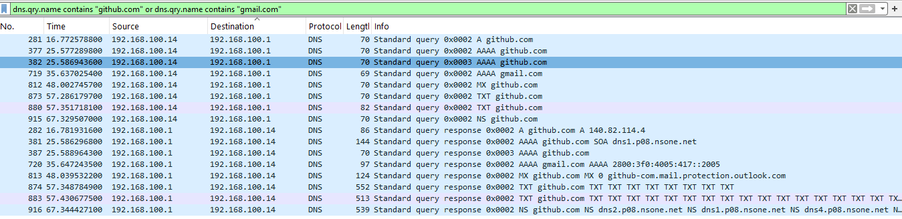

| Type | Result |
|---|---|
| A | 140.82.113.4 |
| AAAA | No record. The AAAA of gmail.com was queried instead: 2800:3f0:4005:417::2005 |
| MX | preference 0, github-com.mail.protection.outlook.com |
| NS | dns1–dns4.p08.nsone.net and four ns-*.awsdns-* servers |
| TXT | SPF plus around 25 third-party verification tokens |

The NS answer confirms what the AAAA response already showed: the zone is
served by AWS Route 53, alongside NS1 as a second provider.

### 3.2 SPF

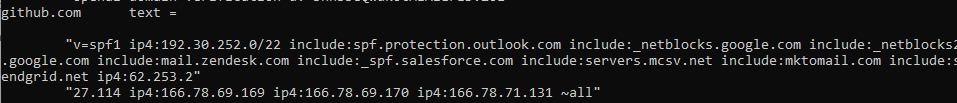

```
v=spf1 ip4:192.30.252.0/22 include:spf.protection.outlook.com
include:_netblocks.google.com include:_netblocks2.google.com
include:mail.zendesk.com include:_spf.salesforce.com
include:servers.mcsv.net include:mktomail.com include:sendgrid.net
ip4:62.253.227.114 ip4:166.78.69.169 ip4:166.78.69.170
ip4:166.78.71.131 ~all
```

SPF lists the servers authorized to send email on behalf of a domain. When a
mail server receives a message, it checks the sender domain's SPF record and
verifies whether the message came from an authorized server. This is what makes
sender spoofing detectable.

The record ends in `~all`, a soft fail: unauthorized mail is accepted but
flagged, rather than rejected outright.

The record is split across two quoted strings. A single TXT string cannot
exceed 255 characters, so longer records are segmented and concatenated by the
receiver — which is why `ip4:62.253.2` and `27.114` appear separated.

TXT records expose more than SPF. Alongside the sender policy, the domain
publishes verification tokens for third-party platforms, which reveal which
SaaS providers the organization uses. This is passive reconnaissance: the
information is public and requires no interaction with the target.

## 4. Command Line Tools

### ipconfig /all

Shows the full interface configuration, including DHCP lease timers.

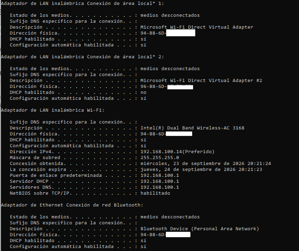

- **Physical Address** — the MAC used in the DHCP Discover
- **DHCP Enabled: Yes** — confirms the address came from a server
- **Lease Obtained / Lease Expires** — this is why DORA does not appear by just
  opening Wireshark: the lease lasts hours. Forcing a release is the only
  practical way to capture the full exchange
- **DNS Servers** — the resolver the client will query, delivered by DHCP

### arp -a

Shows the local ARP cache.

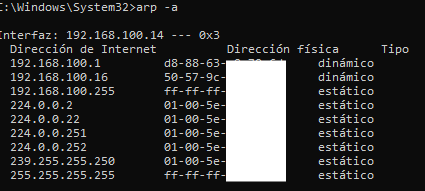

- Dynamic entries were learned through ARP resolution
- Static entries are broadcast and multicast addresses, which need no resolution

### nslookup -type=TXT

Shows SPF in action: which servers are authorized to send email on behalf of
github.com.


### netstat -ano

Shows active connections and listening ports on this host, with the process ID
that owns each one.

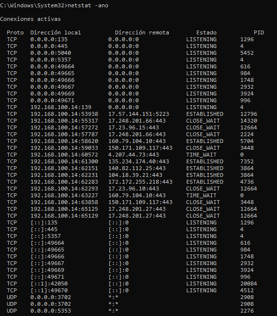

- **LISTENING on 0.0.0.0:135 and :445** — RPC and SMB, exposed by default on
  Windows and a common target on internal networks
- **ESTABLISHED entries on port 443** — outbound HTTPS sessions
- **PID column** — links each connection to the process that opened it, which
  is the starting point when investigating unexpected traffic

### tracert 8.8.8.8

Shows the route from this host to the destination, hop by hop.

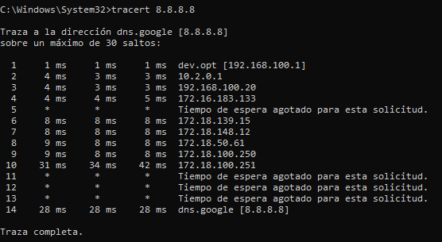

- **Hop 1** is the local gateway; **hop 2** is a private 10.x address, which
  indicates carrier-grade NAT at the ISP
- Hops showing `*` are routers that do not reply to expired-TTL packets. This
  is a configuration choice, not a failure — the trace completes at hop 14

### Reference

| Command | Purpose |
|---|---|
| `ipconfig /release` | Releases the DHCP lease, forcing a new DORA on renew |
| `ipconfig /renew` | Requests a new lease |
| `ipconfig /flushdns` | Clears the DNS cache so queries leave the host |
| `arp -d *` | Clears the ARP cache, forcing re-resolution |
| `ping` | Tests reachability |
| `netsh interface show interface` | Lists adapters and their exact names |
| `netsh interface set interface` | Disables or enables an adapter |
| `route print` | Shows the host routing table |

## Limitations

- **SLAAC could not be captured.** The ISP does not provide IPv6 connectivity,
  so no Router Advertisements are present on the segment.
- **VPN encapsulation was not captured.** This is documented as pending.
- **The capture point limits visibility.** The DNS section shows only the stub
  resolver exchange between the client and the local resolver. The recursive
  lookup happens upstream and is not visible from this vantage point.
- **Raw captures are not published.** Only annotated screenshots are included,
  since sanitizing binary capture files reliably is impractical.
