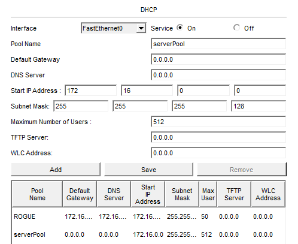
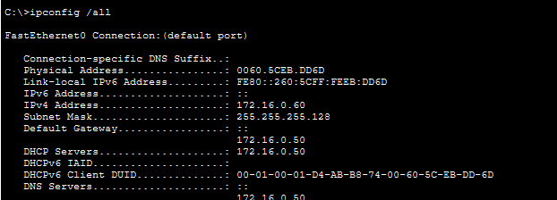
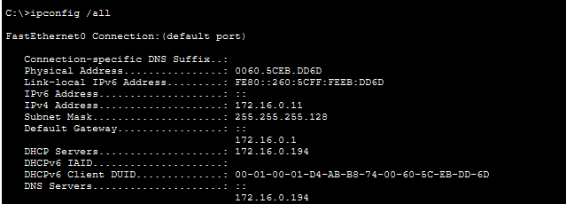
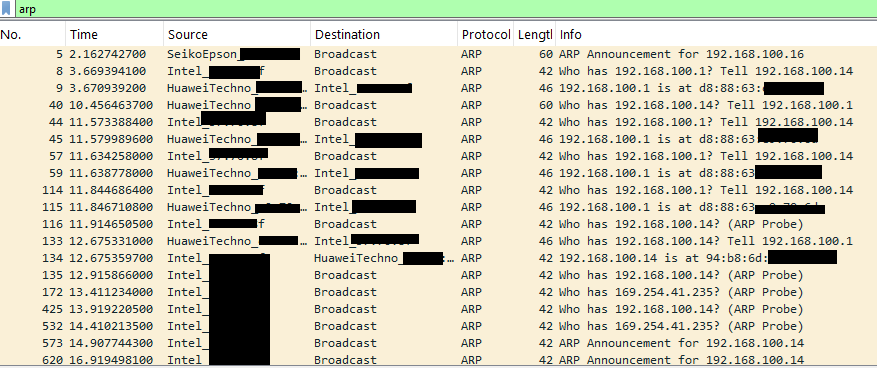

# Threats and Detection

All attack scenarios in this document were simulated inside the Packet Tracer
lab only, as defined in SCOPE.md.

## Case 1 — Rogue DHCP server

### Setup

DHCP snooping was already configured on MAIN-SWITCH. It was disabled
temporarily to observe the effect of an unauthorized server:

```
configure terminal
no ip dhcp snooping
end
```

An unauthorized server was added to the Corporate VLAN with this pool:

| Field | Value |
|---|---|
| Pool name | ROGUE |
| Default gateway | 172.16.0.50 |
| DNS server | 172.16.0.50 |
| Start IP | 172.16.0.60 |
| Subnet mask | 255.255.255.128 |
| Max users | 50 |



The active pool is ROGUE. The default `serverPool` entry is unused.

### Result without mitigation

When a client renews its lease, both servers can answer and the client accepts
the first offer. Across several renewals, the legitimate server answered some
requests and the rogue server answered others.

After `ipconfig /release` and `ipconfig /renew` on PC-CORP-1, the client
received its configuration from the rogue server:



The DHCP server, default gateway and DNS server all point to 172.16.0.50. The
client appears to work normally, but its gateway and name resolution are
controlled by an unauthorized host.

### Mitigation

DHCP snooping was re-enabled, with the uplink as the only trusted port:

```
configure terminal
ip dhcp snooping
ip dhcp snooping vlan 10
ip dhcp snooping vlan 40
no ip dhcp snooping information option
interface gigabitethernet0/1
 ip dhcp snooping trust
 exit
end
write memory
```

After repeating the renewal, the client received its configuration from the
legitimate server, with gateway 172.16.0.1 and DNS 172.16.0.194:



Offers arriving on untrusted ports are now dropped by the switch, so the rogue
server can no longer answer clients.

## Case 2 — ARP poisoning (documented, not executed)



ARP has no authentication: hosts accept announcements they never requested. The
capture in Module 4 shows this at line 5, where a printer announces its address
with a gratuitous ARP and the client stores the mapping without having asked.

The same property is what makes ARP poisoning possible: a false announcement
for the gateway's address would be accepted in the same way.

**Detection signature**

- Two different MAC addresses claiming the same IP address
- Gratuitous ARP announcements for the gateway more frequent than normal

**Control**

Dynamic ARP Inspection validates every ARP packet received on untrusted ports
against the DHCP snooping binding table and drops those that do not match:

```
configure terminal
ip arp inspection vlan 10
ip arp inspection vlan 40
interface gigabitethernet0/1
 ip arp inspection trust
```

The uplink is trusted because the router uses static addresses and has no entry
in the binding table.

## Threat Model

| # | Threat | Affected zone | Control implemented | Gap |
|---|---|---|---|---|
| 1 | Rogue DHCP server | Corporate, Wireless | DHCP snooping, trusted uplink | Not applied to the Servers VLAN |
| 2 | ARP poisoning | Corporate, Wireless | Dynamic ARP Inspection | Depends on the snooping binding table; static hosts need manual entries |
| 3 | Unauthorized device on access port | Corporate, Servers, OT | Port security, sticky MAC | MAC addresses can be spoofed |
| 4 | Lateral movement IT → OT | OT | ACLs 101–103 on R1, ACL 105 on R2 | Stateless, no session tracking |
| 5 | Compromised web server pivots inward | All | ACL 104 blocks DMZ → internal | DNS, NTP and Syslog to the server remain open |
| 6 | Shared wireless key | Wireless | WPA2-PSK with AES | Key cannot be revoked per user; WPA2-Enterprise not supported in Packet Tracer |
| 7 | Rogue IPv6 router advertisements | Corporate, Wireless | None — DHCP snooping covers IPv4 only | RA Guard not configured; hosts have IPv6 enabled on the LAN |
| 8 | Name resolution answered by an unauthorized host (LLMNR) | Corporate, Wireless | None | LLMNR enabled by default; should be disabled via Group Policy |
