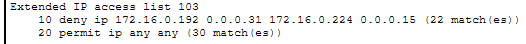

# Troubleshooting Log

Three failures encountered while building the IT/OT segmentation lab. None were
staged: each one appeared during normal work and was diagnosed before the
module could continue. Each is documented with the CompTIA seven-step
methodology.

---

## Case 1 — OT switch lost NTP synchronization after applying ACL 103

### 1. Identify the problem

After applying the segmentation ACLs, `show ntp status` on the OT switch
reported `Clock is unsynchronized, stratum 16, no reference clock`. The switch
had been synchronized before the ACLs were applied.

Syslog messages from the same switch were still arriving at the server.

### 2. Establish a theory of probable cause

NTP requires a reply: the client asks for the time and the server answers.
Syslog does not — it sends over UDP 514 and expects no response.

If only the protocol that needs a reply failed, the problem is most likely in
the return path, not in the outbound path. ACL 103 filters traffic entering R1
from the Servers VLAN, which is exactly where the NTP reply travels:

```
access-list 103 deny ip 172.16.0.192 0.0.0.31 172.16.0.224 0.0.0.15
```

Source: the Servers subnet. Destination: the OT subnet. The NTP reply matches
both.

### 3. Test the theory

**Connectivity first.** `ping 172.16.0.194` from the OT switch returned 100%
success. The path exists, so the failure is not routing — it is filtering.

**Read the counters.** `show access-lists` on R1 showed matches on the deny
line of ACL 103 while the OT switch was attempting to synchronize. Traffic was
reaching that rule and being dropped.



Theory confirmed.

### 4. Establish a plan of action

Add explicit permit rules for the return traffic, placed above the deny, since
an ACL stops at the first match. A numbered ACL cannot take a new line at the
top, so the whole list has to be rewritten.

### 5. Implement the solution

```
no access-list 103
access-list 103 permit udp host 172.16.0.194 eq 123 172.16.0.224 0.0.0.15
access-list 103 permit udp host 172.16.0.194 eq 514 172.16.0.224 0.0.0.15
access-list 103 deny ip 172.16.0.192 0.0.0.31 172.16.0.224 0.0.0.15
access-list 103 permit ip any any
```

### 6. Verify full system functionality

`show ntp status` on the OT switch returned to a synchronized state. The
segmentation rule still holds: a ping from the server toward the OT zone fails,
and `show access-lists` shows the NTP permit line accumulating matches.

### 7. Document findings, actions and outcomes

Stateless ACLs do not distinguish a new session from its reply. Any rule that
blocks a direction must be paired with explicit permits for the return traffic
of the services allowed to cross.

The Syslog return rule shows zero matches, which confirms the protocol is
unidirectional and never needed it. It was left in place as a safeguard.

A stateful firewall would track the session and make both return rules
unnecessary.

---

## Case 2 — R2 became unreachable after removing `permit ip any any`

### 1. Identify the problem

ACL 105 was written as a whitelist on R2, filtering traffic entering from the
IT side toward the OT zone. The final `permit ip any any` was deliberately
removed, on the reasoning that R2 has only two interfaces, so every packet
arriving from IT is destined for OT and a general permit would never match.

After the change, R2 could not reach anything: `ping 172.16.1.9` to R1 failed,
`ping 172.16.0.194` to the server failed, and NTP on R2 never synchronized.

The OT switch behind R2 continued working normally.

### 2. Establish a theory of probable cause

R2 owns two addresses: `172.16.0.225` in the OT subnet and `172.16.1.10` on the
link to R1. Traffic addressed to `172.16.1.10` is destined for the router
itself, not for the OT zone.

ACL 105 permits only UDP from the server:

```
access-list 105 permit udp host 172.16.0.194 172.16.0.224 0.0.0.15
access-list 105 deny ip any 172.16.0.224 0.0.0.15
```

ICMP is not UDP, and `172.16.1.10` is not inside `172.16.0.224/28`. Replies
addressed to R2 match neither line and fall through to the implicit deny.

### 3. Test the theory

**Eliminate the physical layer.** `show ip interface brief` on both routers
showed the link interfaces up/up with the correct addresses and masks. The
cable showed link on both ends.

**Eliminate the neighbour.** `show run | include access-group` on R1 returned
exactly four entries, none of them on the interface facing R2. R1 was not
filtering the link.

**Narrow the protocol.** The OT switch, whose traffic is UDP to the server,
kept working. Only traffic involving R2's own address failed, and the only
protocol permitted by ACL 105 is UDP.

That combination points to one cause: the ACL filters everything entering the
interface, including packets addressed to the router itself.

### 4. Establish a plan of action

Restore the final `permit ip any any`. The two rules above it still enforce the
segmentation: return traffic from the server is permitted, everything else
toward the OT subnet is denied, and only traffic addressed to R2 itself reaches
the general permit.

### 5. Implement the solution

```
no access-list 105
access-list 105 permit udp host 172.16.0.194 172.16.0.224 0.0.0.15
access-list 105 deny ip any 172.16.0.224 0.0.0.15
access-list 105 permit ip any any
```

### 6. Verify full system functionality

`ping 172.16.1.9` from R2 succeeded, NTP on R2 synchronized, and pings from
Corporate toward the OT zone still failed as intended.

### 7. Document findings, actions and outcomes

An interface ACL cannot distinguish transit traffic from traffic addressed to
the router that hosts it. The original reasoning — that an unused rule is a
rule you do not control — is sound, but it did not account for the router's own
addresses being a valid destination.

On a real device this separation is handled elsewhere: traffic to the router is
controlled with control-plane policing or with `access-class` on the VTY lines,
while interface ACLs handle transit only. Mixing both roles in one list is what
caused the failure.

---

## Case 3 — RADIUS authentication failed after restarting the simulator

### 1. Identify the problem

AAA authentication against RADIUS worked on MAIN-SWITCH. After closing and
reopening Packet Tracer, login with the RADIUS account returned
`% Login invalid`. The local break-glass account did not work either, leaving
the device inaccessible.

### 2. Establish a theory of probable cause

Two candidates: the switch lost network reachability to the RADIUS server, or
the configuration itself was not present after the restart.

### 3. Test the theory

**Reachability.** `ping 172.16.0.194` from the switch returned 100% success.
The server was reachable, so the problem was not the network.

**Configuration.** `show run | include radius` returned only the
`aaa authentication login default group radius local` line. The
`radius-server host` entry was absent — the switch was told to authenticate
against RADIUS but had no server defined.

**Persistence.** `show startup-config` confirmed the same: `aaa new-model` and
the authentication line were stored in NVRAM, but the server definition was
not.

The configuration had been applied to the running configuration and never
saved.

### 4. Establish a plan of action

Recover access, reconfigure the RADIUS server entry, and save to NVRAM. In
Packet Tracer this requires two separate saves: `write memory` for the device,
and saving the `.pkt` file for the workspace.

### 5. Implement the solution

Access was recovered by reopening the `.pkt` without saving, which restored the
last persisted state. Then:

```
radius-server host 172.16.0.194 auth-port 1645 acct-port 1646 key <REDACTED>
end
write memory
```

### 6. Verify full system functionality

`show running-config` confirmed the entry was present, and login with the
RADIUS account succeeded.

A separate intermittent issue appeared during testing: authentication failed
even with matching configuration on both ends, and resolved after restarting
the simulator. This suggests a tool limitation rather than a configuration
error, and is documented as such.

### 7. Document findings, actions and outcomes

The running configuration lives in RAM and is lost on reboot. The startup
configuration lives in NVRAM and persists. Applying a command changes only the
first.

The more serious finding is the break-glass account. A local account was
created before enabling AAA precisely so the device would remain accessible if
RADIUS failed, but it was never tested. When it was needed, it did not work,
and the only recovery path was discarding unsaved work.

An emergency account that has not been verified is not a safeguard, it is an
assumption. Testing it before enabling AAA is part of the procedure, not an
optional step.

---

## Summary

| # | Failure | Root cause | Category |
|---|---|---|---|
| 1 | NTP unsynchronized on OT switch | ACL blocked the return path of a bidirectional protocol | Configuration — filtering |
| 2 | R2 unreachable | Interface ACL also filtered traffic addressed to the router itself | Design — control plane vs transit |
| 3 | RADIUS login failed | Configuration never written to NVRAM | Operational — persistence |

Three recurring lessons:

- **Verify before changing.** In every case, `ping` and `show` commands
  identified the cause before any configuration was modified.
- **Counters localize the rule.** `show access-lists` points at the exact line
  that captured the traffic, which removes guesswork from ACL troubleshooting.
- **An untested safeguard is not a safeguard.** This applies to the break-glass
  account and to saving configuration: both were in place on paper and neither
  worked when needed.
